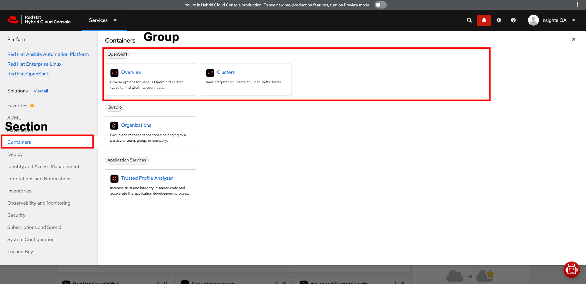

# Frontend Operator Migration Guide

The configurations for navigation, module configuration, search, service tiles, and others are now deprecated. The configuration files will be generated via the Frontend Operator. Configuration partials are embedded into the Frontend resource file. This file is mandatory for frontends to deploy to the HCC platform.

This documentation only describes the migration steps. If you are looking for detailed documentation about the spec and how to use it, please see the [frontend starter app docs](https://github.com/RedHatInsights/frontend-starter-app/blob/master/docs/frontend-operator/index.md).

## Multiple Environment Configurations

The Chrome service has a separate configuration file for each environment. Because the environment configuration is generated based on the existing Frontend resources in a cluster within the frontend namespace, this is no longer a requirement. The recommended approach is to have a single configuration defined by the Frontend resources. If, however, your project requires a separate configuration file for whatever reason, a new deployment file has to be created and referenced in the app interface configuration within the frontend repository.

## Frontend CRD schema validation

To have full development support for the latest FEO features, update the build and development dependencies in your project. The tools are validating the CRD during development/build time.

Make sure to upgrade `@redhat-cloud-services/frontend-components-config@6.4.4` and `@redhat-cloud-services/frontend-components-config-utilities@4.1.3` dependencies. These should be listed in your project `package.json`. Your project may have one, or both dependencies listed. A package is installed if:
  - `@redhat-cloud-services/frontend-components-config` if you are using the FEC binary for your build and development, or if you are creating your webpack config using the presets from the package.
  - `@redhat-cloud-services/frontend-components-config-utilities` if you are using the webpack development proxy directly and not via the config package.

Once you update the version numbers, please reinstall your dependencies

```shell
# if you are using npm
npm i
# if you are using yarn
yarn
```

If your IDE supports validating yaml files from a json schema, or you need the schema for additional validation, you can reference it on this link:

```bash
https://raw.githubusercontent.com/RedHatInsights/frontend-components/refs/heads/master/packages/config-utils/src/feo/spec/frontend-crd.schema.json
```
For VSCode, you can add a following line to the top of the Frontend resources yaml. By default the file should be located at `deploy/frontend.yaml` in your repository.

```yaml
# yaml-language-server: $schema=https://raw.githubusercontent.com/RedHatInsights/frontend-components/refs/heads/master/packages/config-utils/src/feo/spec/frontend-crd.schema.json
```

## Enabling FEO for Configuration Generation

In order to enable the new FEO features, the frontend has to "opt in". Only then will the Frontend Operator start using the Frontend resource to generate the Chrome UI configuration.

Example of how to enable the Frontend Operator features:

```yaml
# deploy/frontend.yaml configuration if in a frontend repository
# unrelated attributes are omitted
objects:
  - spec:
      feoConfigEnabled: true # flags a frontend to be ready for FEO features
```

## fed-modules.json Replacement

The basic configuration of a frontend module was defined in the `static/stable/<env>/modules/fed-modules.json` in the [chrome service backend repository](https://github.com/RedHatInsights/chrome-service-backend). This configuration needs to be split and moved over to the Frontend resource configuration. Usually, frontends have a `deploy/frontend.yaml` file in their repository ([starter app example](https://github.com/RedHatInsights/frontend-starter-app/blob/master/deploy/frontend.yaml)).

Currently, your application may have already defined a "fed-modules.json replacement entry" in your `deploy/frontend.yaml`. **This configuration is likely out of date or refers to the starter app!**. The actual configuration used by Chrome UI prior to migration is located in the chrome service backend repository in the `static/stable/<env>/modules/fed-modules.json` file.

The configuration should be added/updated at `objects[0].spec.module` in your `deploy/frontend.yaml`. Configuration can be simply transferred from the existing `fed-modules.json` from the chrome service backend. You can use JSON -> YAML conversion tool (online or local) to get exact match. If the validation fails because of a attribute not being allowed, remove it from the Frontend resource yaml.

For example, the Frontend resource module config migration for the **Learning Resources UI module** should look like this:

```js
// existing learning resources configuration in static/stable/stage/modules/fed-modules.json

{
  // the entire entry under the "learningResources" key can be transferred to the frontend/deploy.yaml in the learning resources repository
  "learningResources": {
      "manifestLocation": "/apps/learning-resources/fed-mods.json",
      "modules": [
          {
              "id": "learningResources",
              "module": "./RootApp",
              "routes": [
                  {
                      "pathname": "/openshift/learning-resources",
                      "props": {
                          "bundle": "openshift"
                      }
                  },
                  {
                      "pathname": "/ansible/learning-resources",
                      "props": {
                          "bundle": "ansible"
                      }
                  },
                  {
                      "pathname": "/insights/learning-resources",
                      "props": {
                          "bundle": "insights"
                      }
                  },
                  {
                      "pathname": "/edge/learning-resources",
                      "props": {
                          "bundle": "edge"
                      }
                  },
                  {
                      "pathname": "/settings/learning-resources",
                      "props": {
                          "bundle": "settings"
                      }
                  },
                  {
                      "pathname": "/iam/learning-resources",
                      "props": {
                          "bundle": "iam"
                      }
                  },
                  {
                      "pathname": "/hac/learning-resources",
                      "props": {
                          "bundle": "hac"
                      }
                  },
                  {
                      "pathname": "/subscriptions/learning-resources",
                      "props": {
                          "bundle": "subscriptions"
                      }
                  },
                  {
                      "pathname": "/application-services/learning-resources",
                      "props": {
                          "bundle": "application-services"
                      }
                  }
              ]
          },
          {
            "id": "learningResourcesGlobal",
            "module": "./GlobalLearningResourcesPage",
            "routes": [
                {
                    "pathname": "/staging/global-learning-resources-page"
                }
            ]
          },
          {
             "id": "learningResourcesCreator",
             "module": "./Creator",
             "routes": [
                 {
                     "pathname": "/staging/learning-resources-creator"
                 }
             ]
          }
      ]
  },
}

```

The `deploy/frontend.yaml` file module config will have the following format:

```yaml
# unrelated attributes are omitted to reduce the size of the example
objects:
  - spec:
      module:
        manifestLocation: "/apps/learning-resources/fed-mods.json"
        modules:
        - id: learningResources
          module: "./RootApp"
          routes:
          - pathname: "/openshift/learning-resources"
            props:
              bundle: openshift
          - pathname: "/ansible/learning-resources"
            props:
              bundle: ansible
          - pathname: "/insights/learning-resources"
            props:
              bundle: insights
          - pathname: "/edge/learning-resources"
            props:
              bundle: edge
          - pathname: "/settings/learning-resources"
            props:
              bundle: settings
          - pathname: "/iam/learning-resources"
            props:
              bundle: iam
          - pathname: "/hac/learning-resources"
            props:
              bundle: hac
          - pathname: "/subscriptions/learning-resources"
            props:
              bundle: subscriptions
          - pathname: "/application-services/learning-resources"
            props:
              bundle: application-services
        - id: learningResourcesGlobal
          module: "./GlobalLearningResourcesPage"
          routes:
          - pathname: "/staging/global-learning-resources-page"
        - id: learningResourcesCreator
          module: "./Creator"
          routes:
          - pathname: "/staging/learning-resources-creator"

```

## Navigation Items Migration

Currently, the Chrome left-hand navigation is defined in "bundles" in the `static/stable/<env>/navigation/<bundle>-navigation.json`.

The Frontend Operator scans each Frontend resource for "bundle segments" or "navigation segments" and generates the bundles from them.

To learn about the navigation and bundle segments and their options, please read [frontend starter app docs](https://github.com/RedHatInsights/frontend-starter-app/blob/master/docs/frontend-operator/index.md).
- [bundle segments](https://github.com/RedHatInsights/frontend-starter-app/blob/master/docs/frontend-operator/navigation.md#bundle-segments)
- [navigation segments](https://github.com/RedHatInsights/frontend-starter-app/blob/master/docs/frontend-operator/navigation.md#navigation-segment)

### Migration Steps:

1. Locate valid navigation items that should be controlled by your UI module and your development team. Navigation files can be found in the chrome service backend repository under
`static/stable/<env>/navigation/<bundle>-navigation.json`. Your navigation items might be included in multiple navigation files!

2. Make sure that relevant navigation items in the chrome service backend navigation files have **a unique ID**. The ID attribute is mandatory in the Frontend resource.

3. Transfer the navigation metadata from the chrome service navigation files to the `deploy/frontend.yaml` or its equivalent in your project repository. Bundle segments and navigation segments have to be properly identified. A detailed description of both can be found in the [frontend starter app docs](https://github.com/RedHatInsights/frontend-starter-app/blob/master/docs/frontend-operator/navigation.md#navigation). You can identify relevant navigation items byt the `id`, `href`, or `title` attributes.

Example of a bundle segment from the Learning Resources app:

```yaml
# deploy/frontend.yaml in learning resources repository
# unrelated attributes are omitted

objects:
  - spec:
      bundleSegments:
        - segmentId: learning-resources-settings
          bundleId: settings
          position: 300
          navItems:
            id: learningResources
            title: Learning Resources
            href: /settings/learning-resources
        - segmentId: learning-resources-insights
          bundle: insights
          position: 900
          navItems:
            id: learningResources
            title: Learning Resources
            href: /insights/learning-resources
            product: Red Hat Insights
```

Any navigation items structure is currently accepted as a valid bundle segment navigation item. Attributes related to search and services dropdown are no longer allowed in the Frontend resources navigation items spec. The validation during build time will point these attributes out.

The **segmentId** attribute is custom attribute and does not reflect any existing attribute in navigation items.

The **bundleId** attribute is an id of a bundle (set of UI modules) to which the link should be added. It is the `id` attribute on the top of the bundle navigation file. For example, for the settings bundle, [the bundleId is `settings`](https://github.com/RedHatInsights/chrome-service-backend/blob/main/static/stable/stage/navigation/settings-navigation.json#L2).

```js
// the https://github.com/RedHatInsights/chrome-service-backend/blob/main/static/stable/stage/navigation/settings-navigation.json#L2 file
{
    "id": "settings", // this is the "bundleId" for settings bundle navigation
    "title": "Settings",
    "navItems": [
        {
// ...
```

Make sure to leave enough room in between individual bundle segments. This can be done trough the **position** attribute which dictates the ordering of navigation items.

We recommend leaving gaps of at least 100. This will ensure there is plenty of room for other bundle segments (navigation items) to be injected in between nav items.

Follow a general rule.
- if the navigation items from a bundle segment are located in the top third, use position numbers between 100 and 1000
- if the items are somewhat in the middle use position in range from 1000 to 2000
- if your items are towards the bottom, use position above 2000

You will have to inspect the existing navigation files and decide the position value based on it. It might take a while for these values to settle during the migration window. A collaboration with the platform team might be required.

In case there should be a "foreign" navigation item in your bundle segment with a **flat nav items structure** (not expandable or a group), it is highly recommended to split the navigation items into multiple bundle segments to remove any dependency between the UI modules!

In case your navigation is nested and it includes "foreign" navigation items (from a different UI repository and thus different Frontend resource), navigation segments can be injected from such a "foreign" module to bundle segments.

An example of "navigation segment injection":

```yaml
# unrelated attributes are omitted 
# a bundle segment definition in module A with nested navigation dependency from module B

# module-A Frontend spec
objects:
  - spec:
      metadata:
        name: module-A
      bundleSegments:
        segmentId: module-A-bundle-segment-A
        bundleId: foo
        position: 600
        navItems:
          - id: local-nav-item
            title: Local Nav Item
            href: /foo/bar
          - id: local-expandable-nav-item
            title: Expandable
            expandable: true
            routes:
              - id: local-nested-one
                title: Local Nested One
                href: /foo/bar/local-one
              # this is a reference to a "foreign" navigation segment
              # both the segment ID and the frontend name have to be specified
              - segmentRef:
                  frontendName: module-B
                  segmentId: module-B-segment-A
              - id: local-nested-two
                title: Local Nested Two
                href: /foo/nar/nested-two

# module-B Frontend spec
objects:
  - spec:
      metadata:
        name: module-B
      # no bundle segments
      # navigation segments have to be explicitly referenced otherwise they won't be used
      navigationSegments:
        - segmentId: module-B-segment-A
          navItems:
            - id: foreign-nested-one
              title: Foreign Nested One
              href: /foo/bar/foreign-one
            - id: foreign-nested-two
              title: Foreign Nested Two
              href: /foo/bar/foreign-two

# The FEO will merge the segments into the module-A-bundle-segment-A bundle segment.
# The result of the merge will look like this:

objects:
  - spec:
      metadata:
        name: module-A
      bundleSegments:
        segmentId: module-A-bundle-segment-A
        bundleId: foo
        position: 444
        navItems:
          - id: local-nav-item
            title: Local Nav Item
            href: /foo/bar
          - id: local-expandable-nav-item
            title: Expandable
            expandable: true
            routes:
              - id: local-nested-one
                title: Local Nested One
                href: /foo/bar/local-one
                # The nav items were injected into the segment ref position
              - id: foreign-nested-one
                title: Foreign Nested One
                href: /foo/bar/foreign-one
              - id: foreign-nested-two
                title: Foreign Nested Two
                href: /foo/bar/foreign-two
              - id: local-nested-two
                title: Local Nested Two
                href: /foo/nar/nested-two
```

3. Mark navigation items for "replacement" inside the navigation files. Because of a long migration period during which both static and operator-generated configuration files have to be supported, navigation items in a bundle have to be "marked for replacement" within a bundle until the entire bundle navigation is migrated over.

To an **existing top-level navigation item** in a bundle, add a `feoReplacement` attribute. The attribute value is an `id` of a navigation item from a corresponding bundle segment nav item.

An example:

```js
// staging-navigation.json

{
    "id": "staging",
    "title": "Staging Bundle",
    "navItems": [
        {
            "id": "frontend-starter-app",
            "title": "Starter App",
            "appId": "frontend-starter-app",
            "href": "/staging/starter",
            // this is a reference to a nav item ID from a bundle segment
            "feoReplacement": "frontend-starter-app"
        },
        // ....
    ]
}
```

```yaml
# frontend starter app deploy/frontend.yaml sample

objects:
    spec:
        - segmentId: starter-app
          bundleId: staging
          position: 100
          navItems:
              # ID referenced in the "feo-replacement" attribute
            - id: frontend-starter-app
              title: Starter App Link
              href: /staging/starter
```

Once all top-level navigation items in a bundle have a "feoReplacement" reference, the navigation file can be removed and only the generated output will be used. During the migration window, it has to be ensured that all bundle segments have their equivalent top-level nav items in a corresponding static navigation file. 

## Services Dropdown Replacement

In the current approach, the services dropdown data is partially using navigation items references and static tiles definition.

The new approach no longer allows using navigation items references. This approach caused unexpected changes to the services dropdown and is discontinued. In the Frontend resource, services dropdown tiles have to be explicitly defined and placed into a section and a group.

Current definition can be found at `static/stable/<env>/services/services.json`. This file is a template including the navigation items references and it outputs a `static/stable/<env>/services/services-generated.json` after the `make parse-services` CLI command is triggered.

**Statically defined service tile entry**
By statically defined entry, we mean that the tile is defined as an object.

```js
// example of a statically defined service tile entry
[
  {
  // A service dropdown section
  "id": "automation",
  "title": "Automation",
  "icon": "AutomationIcon",
  "description": "Solve problems once, in one place, and scale up.",
  "links": [
      {
        // A service dropdown group
        "id": "ansible",
        "isGroup": true,
        "title": "Ansible",
        "links": [
          {
            // A service tile entry, statically defined
            "title": "Automation Hub",
            "href": "/ansible/automation-hub/",
            "icon": "AnsibleIcon"
          },
          // ...
        ]
      }
    ]
  }
  // ....
]
```

**A link reference service tile entry**
By statically defined entry, we mean that the tile is defined as an object.

```js
// example of a link reference service tile entry
[
  {
  // A service dropdown section
  "id": "automation",
  "title": "Automation",
  "icon": "AutomationIcon",
  "description": "Solve problems once, in one place, and scale up.",
  "links": [
       {
        // A service dropdown group
        "id": "rhel",
        "isGroup": true,
        "title": "Red Hat Enterprise Linux",
        "links": [
          // References to a link in the "insights" bundle navigation
          // the "insights" substring references the bundle ID
          // the "remediations" substring references the navItem "id" attribute. It can reference any nav item from a bundle. Even expandable nav items or nested nav items.
          "insights.remediations",
          "insights.tasks"
        ]
      },
    ]
  }
  // ....
]

// The snippet of the insights bundle navigation with the link
{
  "id": "insights",
  "title": "Red Hat Insights",
  "navItems": [    
    {
      "title": "Automation Toolkit",
      "expandable": true,
      "routes": [
        {
          "id": "remediations", // this is the referenced nav item
          "appId": "remediations",
          "title": "Remediations",
          "href": "/insights/remediations",
          // ...
        }
      //...
      ]
    }
    // ...
  ]
}
```

To find relevant service tiles you will have to consult with your team/managers/platform team. Usually a UI module "owns" those service tiles which links to the UI module.

**To identify section and group you can do the following**



In the services.json there is a nested structure of links. Firs level is a section, second level is a group a the leafs of the `links` array are individual tiles.
```js
[
  {
  // A service dropdown section ID
  "id": "containers",
  "title": "Containers",
  "icon": "CubeIcon",
  "description": "Run your applications in a consistent and isolated environment.",
  // definition of section groups
  "links": [
       {
        // A service dropdown group ID
        "id": "openshift",
        "isGroup": true,
        "title": "OpenShift",
        "links": [
          // items define individual tiles
        ]
      },
      // ...
    ]
  }
  // ....
]
```

To migrate, follow these steps:

1. Make sure the referenced link or the statically defined entry has the `id` attribute.

2. Run the `parse-services` to generate the `services-generated.json` or look at the response payload of https://console.stage.redhat.com/api/chrome-service/v1/static/stable/stage/services/services-generated.json response.

3. Transfer the corresponding configuration from the `services-generated.json` to the Frontend resource. Only a subset of attributes is valid for the Frontend resources. There is no need for all navigation items attributes as most of them are not used.

Example migration:

```js
// services-generated.json snippet
[
  {
    "description": "Solve problems once, in one place, and scale up.",
    "icon": "AutomationIcon",
    // This is a section attribute
    "id": "automation",
    "links": [
      {
        // this is a group attribute
        "id": "rhel",
        "isGroup": true,
        "links": [
          {
            // example of unnecessary attribute for the service tile
            "alt_title": [
              "Remediate",
              "playbook",
              "fix",
              "solve",
              "find it fix it",
              "fifi",
              "cloud connector",
              "insights",
              "automation",
              "Ansible",
              "patch"
            ],
            "appId": "remediations",
            "description": "Use Ansible Playbooks to resolve configuration, security, and compliance issues identified on your Red Hat Enterprise Linux systems.",
            "href": "/insights/remediations",
            "icon": "InsightsIcon",
            "id": "remediations",
            "product": "Red Hat Insights",
            "subtitle": "Red Hat Insights for RHEL",
            "title": "Remediations"
          },
          // ... other configuration
        ]
      }
    ]
  }
]
```

```yaml
objects:
    spec:
      serviceTiles:
        - id: remediations
          # place service tile into the automation section 
          section: automation
          # place service tile into the ansible group within the automation section
          group: ansible
          title: Remediations
          href: /insights/remediations
          description: Use Ansible Playbooks to resolve configuration, security, and compliance issues identified on your Red Hat Enterprise Linux systems.
          icon: InsightsIcon
```

The entry should be removed from the services.json static template.

## Search Index Migration

### Pre-requisites

The search index is currently generated from:
1. The service.json template.
2. Statically defined entries in `cmd/search/static-services-entries.json`.

In the FEO approach, search entries have to be explicitly defined. The data is no longer inferred from the services dropdown data. To prevent duplicate entries, make sure the service tiles entries were migrated and the entry was removed from the `service.json` template and the `static-services-entries.json` files.

### Migration Steps

1. Make sure the services dropdown tiles of the affected UI module were removed from the `services.json` template and from the static `static-services-entries.json` files.
2. Define search entries in the `deploy/frontend.yaml` file or its equivalent.

Example of search entries config:

```yaml
# unrelated attributes are omitted
objects:
  - spec:
      searchEntries:
        - id: "starter"
          title: "Starter App FEO Testing Link"
          href: /staging/foo/starter
          description: "An experimental link to test FEO features integration"
          alt_title:
            - Starter
            - Starter App

```

For full documentation about available attributes, please read [frontend starter app docs](https://github.com/RedHatInsights/frontend-starter-app/blob/master/docs/frontend-operator/index.md).
